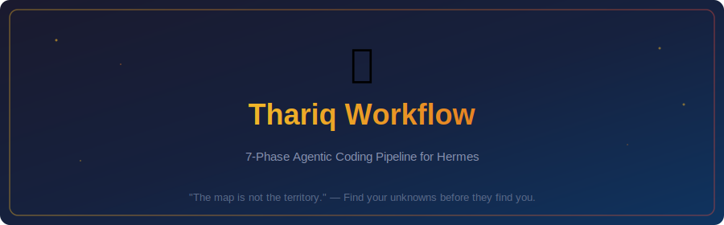

<p align="center">
  <picture>
    <source media="(prefers-color-scheme: dark)" srcset="assets/banner.svg">
    
  </picture>
</p>

<p align="center">
  <a href="LICENSE"></a>
  <a href="https://github.com/NousResearch/hermes-agent"></a>
  <a href="#"></a>
  <a href="README.zh-CN.md"></a>
</p>

---

> **"Fable is the first model where the quality of the work is bottlenecked by my ability to clarify its unknowns."**
> — Thariq, Claude Code @ Anthropic

A **Hermes skill** that encodes a 7-phase agentic coding workflow. When the model is strong enough that **the bottleneck is no longer the AI — it's your ability to surface and manage unknowns** — this workflow helps you do exactly that.

---

## 🧭 The Workflow

| # | Phase | Trigger Phrase | What It Does |
|---|-------|---------------|-------------|
| 1 | **Blind Spot Pass** | **盲点扫描** | Find what you don't know you don't know |
| 2 | **Brainstorm** | **给我几个方向** | Generate 4 wildly different approaches |
| 3 | **Interview** | **采访我** | Agent asks YOU one question at a time |
| 4 | **References** | **参考这个** | Anchor in real code/design examples |
| 5 | **Plan** | **出实现计划** | Lead with decisions most likely to change |
| 6 | **Implement** | **开始实现** | Build + track every deviation from plan |
| 7 | **Deliver + Quiz** | **打包 + 考我** | Package for buy-in, then test yourself |

## ⚡ Quick Start

```bash
git clone https://github.com/ennheng/hermes-thariq-workflow.git ~/.hermes/skills/thariq-workflow
```

Then say **"启动 Thariq 模式"** in any Hermes session.

## 🎯 When to Use

✅ Complex multi-file features · unfamiliar codebase areas · new domains/tech stacks · failed attempts with unclear causes · research and analysis tasks

❌ Single-line bug fixes · trivial mechanical changes · fully-scoped tasks

## 🧠 The Framework

| Known Knowns | Known Unknowns |
|---|---|
| What you told the agent | What you know you haven't figured out |
| **Unknown Knowns** 🚨 | **Unknown Unknowns** |
| Obvious to you, never written down | Haven't considered at all |

The entire pipeline converts ⬜ red cells into 🟩 green ones.

## 📄 License

MIT — use it, remix it, share it.

## 🌐 Language

[English](README.md) · [简体中文](README.zh-CN.md)
