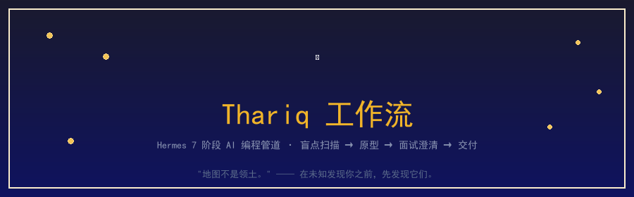

<p align="center">
  
</p>

<p align="center">
  <a href="LICENSE"></a>
  <a href="https://github.com/NousResearch/hermes-agent"></a>
  <a href="#"></a>
  <a href="README.md"></a>
</p>

---

> **"Fable 是我遇到的第一款模型，工作质量不再受限于 AI 能力，而是受限于我澄清'未知'的能力。"**
> — Thariq，Anthropic Claude Code 团队

一个 **Hermes 技能**，将 7 阶段 AI 编程工作流编码为可复用的自动化流程。当模型足够强时，瓶颈不再是 AI——而是你表达需求、管理不确定性的能力。这个工作流帮你系统性地做到这一点。

---

## 🧭 工作流总览

| # | 阶段 | 触发词 | 做什么 |
|---|------|--------|--------|
| 1 | **盲点扫描** | `盲点扫描` | 找出你不知道自己不知道的东西 |
| 2 | **头脑风暴** | `给我几个方向` | 生成 4 种完全不同的方案 |
| 3 | **面试澄清** | `采访我` | Agent 一次一个问题地采访你 |
| 4 | **参考锚定** | `参考这个` | 用真实代码/设计作为锚点 |
| 5 | **实现计划** | `出实现计划` | 优先暴露最可能被推翻的决策 |
| 6 | **实现** | `开始实现` | 动手 + 记录每一个偏离计划的地方 |
| 7 | **交付 + 自测** | `打包 + 考我` | 打包分享文档，出题考自己 |

## ⚡ 快速开始

```bash
git clone https://github.com/ennheng/hermes-thariq-workflow.git ~/.hermes/skills/thariq-workflow
```

然后在 Hermes 对话中说 **"启动 Thariq 模式"**。

## 🎯 适用场景

✅ 复杂多功能特性 · 代码库陌生区域 · 不熟悉的领域/技术栈 · 上次尝试失败原因不明 · 研究分析任务

❌ 单行 bug 修复 · 简单机械改动 · 已完全想清楚的任务

## 🧠 底层框架

| 已知的已知 | 已知的未知 |
|---|---|
| 你在 prompt 里说清楚的 | 你知道自己还没想清楚的 |
| **未知的已知** 🚨 | **未知的未知** |
| 觉得太明显所以没写 | 完全没意识到 |

整个流程的目标：把 ⬜ 红色格子系统性地变成 🟩 绿色格子。

## 📄 许可证

MIT — 随便用、改、分享。

## 🌐 语言

[English](README.md) · [简体中文](README.zh-CN.md)
